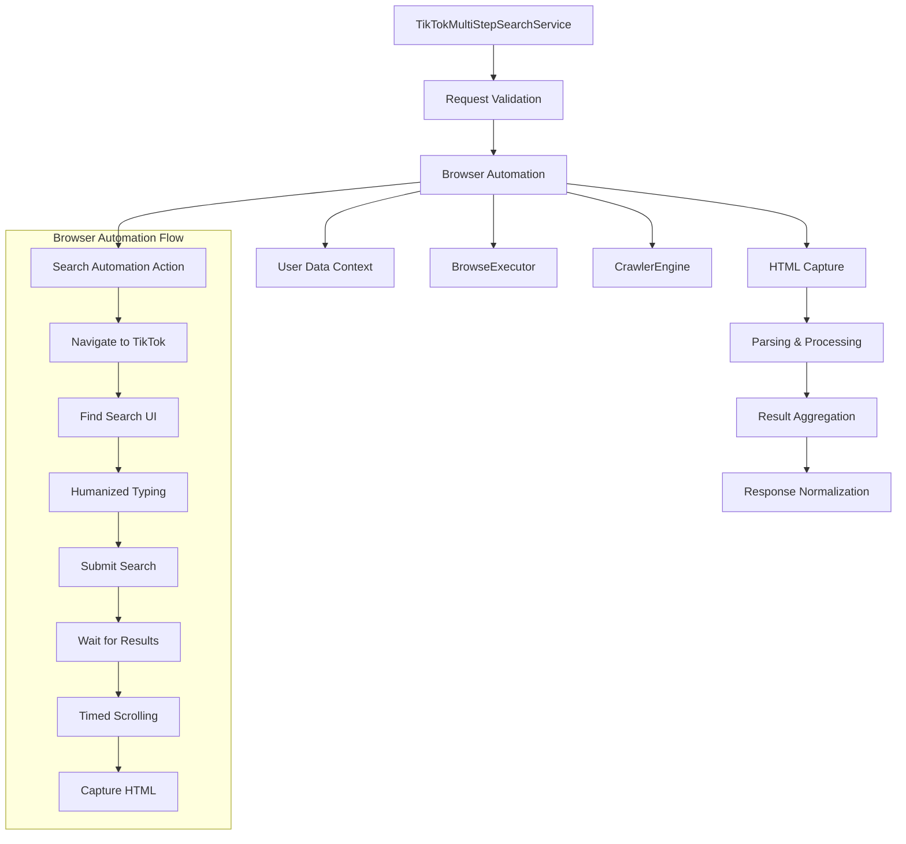

# PRD: TikTok Multi-Step Search Service

## Status

**Status**: Implementation Ready
**Owner**: Backend/API Team
**Last Updated**: 2025-09-17
**Version**: 1.0

## Summary

### Problem

The current URL parameter-based TikTok search service (`TikTokURLParamSearchService`) provides basic search functionality but lacks the robustness and reliability of full browser automation. Teams need a more reliable search implementation that mimics human browsing behavior to avoid detection and improve success rates.

### Goal

Implement a comprehensive multi-step TikTok search service (`TiktokMultistepSearchService`) that replaces the placeholder implementation with a concrete browser automation approach, providing richer search capabilities and improved reliability.

### Non-Goals

- Replace the existing URL parameter service entirely (both implementations will coexist)
- Modify the existing API contract or response format
- Add new search filters or sorting options beyond RELEVANCE
- Change the session management infrastructure

## Introduction/Overview

The TikTok Multi-Step Search Service enhances the existing search functionality by implementing full browser automation instead of relying on URL parameters. This approach provides:

1. **Improved Reliability**: Browser automation better mimics human behavior, reducing detection rates
2. **Enhanced Stealth**: Humanized interactions make the service appear more like legitimate user activity
3. **Better Compatibility**: Works with TikTok's evolving DOM structure that may break URL parameter approaches
4. **Consistent Results**: Produces the same normalized response format as the URL parameter service

## Goals

1. **Replace Placeholder Implementation**: Convert the current `NotImplementedError` placeholder into a fully functional search service
2. **Reuse Proven Patterns**: Leverage existing browser automation infrastructure from the working demo and `/browse` endpoint
3. **Maintain Compatibility**: Ensure identical API response format to the URL parameter service
4. **Improve Success Rates**: Achieve higher reliability through humanized browser interactions
5. **Robust Error Handling**: Implement comprehensive error handling and cleanup procedures

## User Stories/Use Cases

### Primary Users

- **Content Researchers**: Need reliable search results for trend analysis and content discovery
- **Marketing Teams**: Require consistent video sourcing for campaign inspiration
- **Data Pipelines**: Depend on stable search functionality for automated content aggregation

### Use Cases

1. **Single Query Search**: Users search for videos using a single keyword phrase
2. **Multi-Query Aggregation**: Users provide multiple search terms and receive deduplicated results
3. **High-Volume Searching**: Automated systems perform frequent searches without triggering rate limits
4. **International Content**: Support for Unicode queries and multi-language content

## Functional Requirements

### Core Search Functionality

- **FR-MSS-001**: Accept `query` parameter as string or array of strings (identical to URL parameter service)
- **FR-MSS-002**: Support `num_videos` parameter with range 1-50 (cap at 50)
- **FR-MSS-003**: Only support `sort_type="RELEVANCE"` (reject others with validation error)
- **FR-MSS-004**: Accept `recency_days` parameter but treat as best-effort hint

### Browser Automation (Matching working demo)

- **FR-MSS-005**: Launch browser with TikTok base URL using headful mode (`headless=False`)
- **FR-MSS-006**: Utilize user data context for session management (`user_data_context` pattern)
- **FR-MSS-007**: Implement humanized search interactions (`TikTokAutoSearchAction` class)
- **FR-MSS-008**: Perform search navigation through UI elements using configurable selectors
- **FR-MSS-009**: Wait for deterministic search completion signals (URL contains `/search`)
- **FR-MSS-010**: Execute timed scrolling to ensure content rendering (10 seconds)
- **FR-MSS-011**: Capture HTML content after search completion and save to file
- **FR-MSS-012**: Use `BrowseExecutor` and `CrawlerEngine` for browser orchestration
- **FR-MSS-013**: Implement selector arrays with fallback mechanisms for robustness
- **FR-MSS-014**: Handle encoding issues and character set management for search queries

### Result Processing

- **FR-MSS-015**: Reuse existing `TikTokSearchParser` for HTML parsing
- **FR-MSS-016**: Apply same aggregation and deduplication logic as URL parameter service
- **FR-MSS-017**: Track seen video IDs and URLs to prevent duplicates
- **FR-MSS-018**: Implement early-stop logic when target video count is reached
- **FR-MSS-019**: Return normalized response format: `{results, totalResults, query}`
- **FR-MSS-020**: Support HTML file capture for debugging and validation

### Multi-Query Support

- **FR-MSS-021**: Process array queries sequentially in provided order
- **FR-MSS-022**: Aggregate results from multiple queries into single response
- **FR-MSS-023**: Deduplicate by `id` (primary) and `webViewUrl` (fallback)
- **FR-MSS-024**: Preserve child query order in aggregated results
- **FR-MSS-025**: Enable with `run_with_typing` method signature (query as parameter)

### Error Handling & Cleanup

- **FR-MSS-026**: Ensure proper cleanup of user data contexts even on failures
- **FR-MSS-027**: Invoke cleanup callbacks for browser resources
- **FR-MSS-028**: Handle asynchronous execution properly to avoid event loop blocking
- **FR-MSS-029**: Provide informative logging for debugging and monitoring
- **FR-MSS-030**: Save fallback HTML content when full extraction fails

## Non-Functional Requirements

### Performance

- **NFR-MSS-001**: Maintain reasonable search completion times (target < 30 seconds per query)
- **NFR-MSS-002**: Support soft concurrency limits to avoid detection
- **NFR-MSS-003**: Efficient memory usage during browser automation

### Reliability

- **NFR-MSS-004**: Achieve ≥ 95% success rate for search operations
- **NFR-MSS-005**: Handle TikTok DOM changes gracefully with fallback selectors
- **NFR-MSS-006**: Robust connection handling and timeout management

### Security

- **NFR-MSS-007**: No persistent storage of sensitive user data
- **NFR-MSS-008**: Proper cleanup of temporary browser profiles
- **NFR-MSS-009**: Secure handling of user data directories

### Observability

- **NFR-MSS-010**: Comprehensive logging for search operations
- **NFR-MSS-011**: Metrics for success rates, durations, and result counts
- **NFR-MSS-012**: Error tracking with contextual information

## Technical Design Considerations

### Architecture



### Key Components (Matching working demo)

1. **TikTokMultiStepSearchService**: Main service class implementing the search interface
2. **TikTokAutoSearchAction**: Custom page action handling search interactions with specific TikTok selectors
3. **TikTokBrowseCrawler**: Facade class wrapping browser automation functionality
4. **Browser Infrastructure**: Reuses `BrowseExecutor`, `CrawlerEngine`, and `user_data_context` management
5. **Parser Integration**: Leverages existing `TikTokSearchParser` for consistency
6. **Async Handling**: Proper threading to avoid event loop blocking

## Implementation Details (Concrete Requirements from Working Demo)

### Required Class Structure

```python
class TikTokMultiStepSearchService(AbstractTikTokSearchService):
    def __init__(self, service):
        super().__init__(service)
    
    async def search(self, query, num_videos, sort_type, recency_days):
        # Should implement the browse automation approach
        
class TikTokAutoSearchAction(BasePageAction):
    def __init__(self, search_query: str):
        self.search_query = search_query
    
    def _execute(self, page):
        # Should replicate the exact selector logic from working demo
        # Should handle search button, input field, typing, scrolling
        # Should save HTML content
        # Should handle encoding and fallback scenarios

class TikTokBrowseCrawler:
    def __init__(self, config: Optional[TikTokSessionConfig] = None):
        # Should use BrowseExecutor and CrawlerEngine
        
    def run_with_typing(self, url: str, search_query: str) -> Dict[str, Any]:
        # Should implement the browse with action pattern
        
    def _browse_with_action(self, url: str, page_action: BasePageAction):
        # Should use user_data_context for profile management
        # Should handle cleanup properly
```

### Required TikTok Selectors

**Search Interface:**
- `['button[data-e2e="nav-search"]', '.css-1o3yfob-5e6d46e3--DivSearchWrapper e9sj7gd4 button[data-e2e="nav-search"]', '.TUXButton[data-e2e="nav-search"]', '[data-e2e="nav-search"]', 'button[aria-label*="Search"]', '.css-udify9-5e6d46e3--StyledTUXSearchButton']`

**Search Input:**
- `['input[data-e2e="search-user-input"]', 'input[placeholder*="Search"]', 'input[type="search"]', '.search-bar', 'input[placeholder*="search"]', 'input[data-e2e="search-input"]']`

**Result Detection:**
- Content-based: `['[class*="video"]', '[class*="card"]', 'img[src*="tiktokcdn"]', 'video']`
- TikTok-specific: `['[data-e2e="search-result-item"]', '[data-e2e="search-result-video"]']`
- Fallbacks: `['a[href*="/@"]', 'a[href*="/video/"]', '.css-1dc0ofe-5e6d46e3--DivOneColSkeletonContainer']`

### Required Configurables

- **Headful Mode**: `headless=False` for interactive browsing
- **User Data Context**: Temporary profile management
- **Timeouts**: 15 seconds for URL wait, 5 seconds for element detection
- **Scroll Duration**: 10 seconds of timed scrolling
- **Scrolled To Source**: 10 seconds of timed scrolling

### Implementation Patterns

- **Request Validation**: Reuse `_validate_request` from abstract base class
- **Browser Orchestration**: Mirror `_browse_with_action` pattern from browse functionality
- **Humanized Interactions**: Utilize `TikTokAutoSearchAction`, `type_like_human` and `human_pause`
- **Cleanup Guarantees**: Implement finally blocks for resource cleanup
- **Error Resilience**: Continue processing subsequent queries on individual failures
- **User Data Context**: Use `user_data_context` for temporary browser profile management
- **Multi-Selector Strategy**: Implement arrays of selectors with fallback mechanisms
- **Encoding Handling**: Manage UTF-8 encoding with fallback to latin-1 for character encoding

## Scope

### In-Scope

- ✅ Replacement of placeholder multi-step search service
- ✅ Browser automation with humanized interactions
- ✅ HTML capture and parsing using existing infrastructure
- ✅ Identical response format to URL parameter service
- ✅ Multi-query support with deduplication
- ✅ Proper error handling and cleanup
- ✅ Integration with existing TikTok session management

### Out-of-Scope

- ❌ Modification of API contract or response schema
- ❌ New search filters or sorting options
- ❌ Changes to session management infrastructure
- ❌ Replacement of URL parameter service (coexistence)
- ❌ Pagination or infinite scroll support
- ❌ Advanced metadata extraction beyond current capabilities

## Open Questions/Assumptions

### Assumptions

- TikTok's UI structure for search remains relatively stable
- Humanized interactions sufficiently reduce detection rates
- Existing parser logic handles HTML from browser automation correctly
- Performance impact of browser automation is acceptable for use cases

### Open Questions

1. Should the multi-step service completely replace the URL parameter service, or should they coexist as different strategies?
2. What are the optimal timeouts and wait strategies for search completion detection?
3. How should rate limiting be handled between the two service implementations?
4. Are there specific search scenarios where URL parameters might still be preferred?

### Decisions Needed

1. **Service Selection Strategy**: Should the system automatically choose between URL parameter and multi-step approaches, or should this be configurable?
2. **Fallback Mechanism**: If multi-step search fails, should the system fall back to URL parameter approach?
3. **Resource Allocation**: How many concurrent browser instances should be allowed for multi-step searches?

## Future Considerations

### Short-term (v1.1)

- **Performance Optimization**: Tune timeouts and wait strategies
- **Enhanced Detection**: Improve search completion detection heuristics
- **Selector Maintenance**: Establish process for updating UI selectors

### Medium-term (v2.0)

- **Adaptive Strategy**: Automatically choose between URL parameter and multi-step approaches
- **Advanced Filtering**: Support for additional search filters and sorting options
- **Pagination Support**: Limited pagination beyond first results page

### Long-term (v3.0+)

- **Machine Learning**: Adaptive interaction patterns based on success rates
- **Predictive Caching**: Cache frequently searched terms
- **Quality Metrics**: Video quality scoring and ranking

## Success Metrics

### Reliability

- **Target**: ≥ 95% of searches return valid results
- **Measurement**: Success rate over rolling 7-day period
- **Baseline**: Compare against URL parameter service performance

### Performance

- **Target**: Average search time < 30 seconds
- **Measurement**: P90 search completion time
- **Baseline**: Establish baseline after initial implementation

### Cost Efficiency

- **Target**: Minimize browser resource consumption per search
- **Measurement**: CPU/Memory usage per browser instance
- **Baseline**: Monitor during load testing

## Dependencies

### Internal (Matching working demo)

- **Browser Automation Core**: `BrowseExecutor`, `CrawlerEngine`, `CamoufoxArgsBuilder`
- **TikTok Session Management**: `TikTokSessionConfig` with user data context
- **TikTok Parser**: `TikTokSearchParser`
- **Humanization Utilities**: `type_like_human`, `human_pause`, `move_mouse_to_locator`, `click_like_human`
- **Page Action Framework**: `BasePageAction` and custom action classes
- **User Data Management**: `user_data_context` for profile management
- **Crawl Request Schema**: `CrawlRequest` for browser configuration

### External

- **Playwright**: Browser automation library
- **TikTok API**: Underlying platform (no direct API calls, but UI interaction)

## Team & Resources

### Responsible Team

- Backend/API Team

### Required Resources

- Development environment with Playwright
- Access to TikTok for testing

## Approvals

- **Product Management**: [Name] - [Date]
- **Engineering Lead**: [Name] - [Date]
- **QA Lead**: [Name] - [Date]
