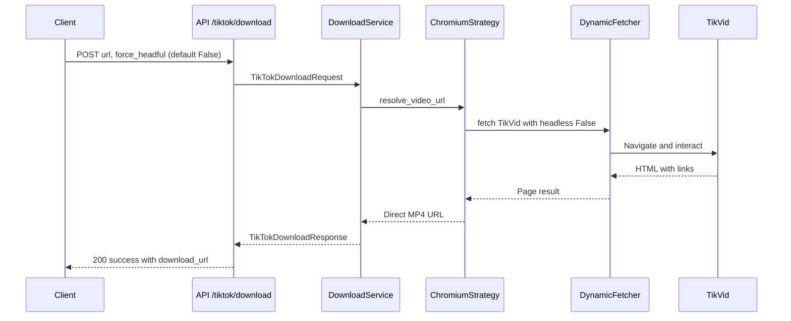

# Sprint 26 - TikTok Download Chromium Headless Parity and Interim Headful Enforcement

## 1) Title and Summary
- Title: TikTok Download Chromium Headless parity and interim headful enforcement
- Summary:
  - Enforce explicit headful mode for Chromium-based TikTok downloads via the strategy to stabilize current behavior.
  - Plan and specify headless parity effort: introduce an API flag force_headful: bool (default False) and ensure full web interaction parity in headless (navigation, search bar, clicking, filling forms, waiting).
  - Maintain persistent Chromium user data when available with master/clone session management.
  - Adhere strictly to layered architecture, schema consistency, TDD-first, and Pydantic settings governance per [AGENTS.md](AGENTS.md).

## 2) Background and Current State
- Endpoint:
  - TikTok download endpoint defined in [tiktok.py](app/api/tiktok.py). See [tiktok_download_endpoint()](app/api/tiktok.py:203)
- Service orchestration:
  - Download service orchestrates resolution via [TikTokDownloadService.download_video()](app/services/tiktok/download/service.py:48)
- Strategy selection:
  - Factory selects strategy by env [TikTokDownloadStrategyFactory.create_strategy()](app/services/tiktok/download/strategies/factory.py:23)
- Current Chromium strategy:
  - Strategy composes Chromium fetch kwargs in [ChromiumDownloadStrategy._build_chromium_fetch_kwargs()](app/services/tiktok/download/strategies/chromium.py:156)
  - Explicit headful is currently set in [fetch_kwargs "headless": False](app/services/tiktok/download/strategies/chromium.py:234)
- Persistent Chromium user data:
  - Master/clone lifecycle managed by [ChromiumUserDataManager](app/services/common/browser/user_data_chromium.py:31)
  - Read-mode clones for downloads obtained via [ChromiumUserDataManager.get_user_data_context()](app/services/common/browser/user_data_chromium.py:58), used by strategy at [user_data_context acquisition](app/services/tiktok/download/strategies/chromium.py:173)
- Browse executor and options resolver refs (for future parity alignment):
  - Chromium browse executor arg composition [ChromiumBrowseExecutor._build_chromium_kwargs()](app/services/browser/executors/chromium_browse_executor.py:156)
  - Options resolution for headless/headful [OptionsResolver.resolve()](app/services/browser/options/resolver.py:10)
- Schemas:
  - TikTok download request/response in [download.py](app/schemas/tiktok/download.py). Request: [TikTokDownloadRequest](app/schemas/tiktok/download.py:9)
- Tests in scope:
  - API unit: [tests/api/test_tiktok_download_endpoint.py](tests/api/test_tiktok_download_endpoint.py)
  - Integration Chromium: [tests/integration/tiktok/test_tiktok_download_chromium.py](tests/integration/tiktok/test_tiktok_download_chromium.py)
  - Integration Camoufox: [tests/integration/tiktok/test_tiktok_download_camoufox.py](tests/integration/tiktok/test_tiktok_download_camoufox.py)
  - Services comprehensive: [tests/services/tiktok/test_tiktok_executor_comprehensive.py](tests/services/tiktok/test_tiktok_executor_comprehensive.py)
  - Test fixtures: [tests/conftest.py](tests/conftest.py)

## 3) Goals and Non-Goals
- Goals:
  - Interim enforcement: /tiktok/download always runs headful mode with Chromium to stabilize current flows.
  - API evolution: add force_headful: bool (default False) for future clients; in interim, strategy-level enforcement remains headful regardless.
  - Headless parity plan:
    - Ensure web interaction parity in headless: navigation to TikVid, click/typing, form submission, waiting for results (network idle or selectors), parse MP4 link extraction.
    - Use persistent warmed profiles via [ChromiumUserDataManager.get_user_data_context()](app/services/common/browser/user_data_chromium.py:58) when available.
    - Integrate BrowserForge fingerprints usage via metadata generated by [ChromiumUserDataManager._generate_browserforge_fingerprint()](app/services/common/browser/user_data_chromium.py:314).
  - Governance alignment: Pydantic settings, layered architecture, TDD-first, no hardcoded configs, schema consistency.
- Non-Goals:
  - Do not modify Camoufox strategy behavior.
  - Do not change TikVid resolver class selection in service (unless needed for testing via mocks).
  - No performance optimizations beyond parity validation benchmarks.
  - No new endpoints; only schema change within /tiktok/download request.

## 4) Detailed Requirements
- API schema change:
  - Add optional force_headful: bool = False to [TikTokDownloadRequest](app/schemas/tiktok/download.py:9)
  - Behavior:
    - Interim: Chromium strategy enforces headful regardless of flag; flag accepted and passed through for future compatibility.
    - Future parity: when parity achieved, if force_headful is False, allow headless mode through strategy while maintaining functionality; if True, enforce headful.
  - Validation:
    - Reject extra fields per existing model_config ["extra": "forbid"] in [TikTokDownloadRequest.model_config](app/schemas/tiktok/download.py:18)
    - Accept force_headful when provided, default False.
- Service behavior:
  - Continue current strategy selection via [TikTokDownloadStrategyFactory.create_strategy()](app/services/tiktok/download/strategies/factory.py:23)
  - Use [TikTokDownloadService.download_video()](app/services/tiktok/download/service.py:48) unchanged for orchestration; headful/headless decided at strategy level (Chromium).
- Strategy behavior:
  - Interim (now): enforce headful in [ChromiumDownloadStrategy._build_chromium_fetch_kwargs() -> fetch_kwargs](app/services/tiktok/download/strategies/chromium.py:233) by keeping "headless": False.
  - Guardrails:
    - Add invariant tests to assert "headless": False is present for download flows until parity flip.
  - Future parity:
    - When parity validated, allow "headless": True when force_headful False and environment default_headless True; else keep headful.
    - Honor persistent user-data dir injection [DynamicFetcher.fetch additional args user_data_dir](app/services/tiktok/download/strategies/chromium.py:258) and [PersistentChromiumFetcher path](app/services/tiktok/download/strategies/chromium.py:96) when available.
- Persistent user data usage:
  - If settings.chromium_user_data_dir set, downloads use read-mode clones [strategy acquiring context](app/services/tiktok/download/strategies/chromium.py:173) to warm cookies.
  - Lifecycle:
    - Clone created at start of request; cleaned in finally block via [user_data_cleanup invocation](app/services/tiktok/download/strategies/chromium.py:137)
    - Master profile updated by headful browse sessions (outside download strategy) using [ChromiumBrowseExecutor with user_data_dir](app/services/browser/executors/chromium_browse_executor.py:217)
    - Cookie export/import APIs: [ChromiumUserDataManager.export_cookies()](app/services/common/browser/user_data_chromium.py:601) and [ChromiumUserDataManager.import_cookies()](app/services/common/browser/user_data_chromium.py:664)

## 5) Architecture & Changes
- Interim enforcement:
  - Enforced at Chromium strategy-level: [ChromiumDownloadStrategy._build_chromium_fetch_kwargs()](app/services/tiktok/download/strategies/chromium.py:156) sets [headless False](app/services/tiktok/download/strategies/chromium.py:234)
  - Do not depend on endpoint or service to toggle headless; isolation keeps layered architecture intact.
- Guard against accidental headless toggles:
  - Introduce unit tests to assert "headless": False in fetch kwargs for downloads.
  - Consider a runtime setting gate in app/core/config (document only) to block headless until a feature flag is flipped; do not hardcode.
- Future integration points for headless parity:
  - Options resolver patterns from browsing [OptionsResolver.resolve()](app/services/browser/options/resolver.py:10) and browsing executor [ChromiumBrowseExecutor._build_chromium_kwargs()](app/services/browser/executors/chromium_browse_executor.py:156) inform headless arg propagation and user_data_dir injection.
  - Ensure [DynamicFetcher.fetch signature detection](app/services/tiktok/download/strategies/chromium.py:248) continues to guard user_data_dir injection safely.

## 6) TDD Plan (Test-first TODOs)
- General approach:
  - Write tests first; get failing (red), implement minimal changes to pass (green), then refactor.
  - Maintain strict separation of layers; tests target API, service, strategy, and schema layers appropriately.

- Schema tests:
  - File: [tests/schemas/test_tiktok_download.py](tests/schemas/test_tiktok_download.py)
    - Add: test_force_headful_default_false
      - Create TikTokDownloadRequest with only url; assert request.force_headful is False by default.
    - Add: test_force_headful_true_acceptance
      - Create TikTokDownloadRequest with url + force_headful True; assert request.force_headful is True; no validation error.
    - Ensure model forbids extra fields remains valid (existing tests should pass).
  - File: [tests/schemas/test_tiktok_force_headful_validation.py](tests/schemas/test_tiktok_force_headful_validation.py)
    - Add specific assertions:
      - test_reject_unknown_fields_when_force_headful_present
      - test_json_schema_includes_force_headful_field

- API endpoint tests:
  - File: [tests/api/test_tiktok_download_endpoint.py](tests/api/test_tiktok_download_endpoint.py)
    - Add: test_download_endpoint_accepts_force_headful_true
      - Post /tiktok/download with {"url": DEMO_TIKTOK_URL, "force_headful": True}, mock service to return success; assert 200 OK and response integrity.
    - Add: test_download_endpoint_accepts_force_headful_default_false
      - Post only "url", verify success; ensures backward compatibility.
    - Existing error mapping tests remain unchanged.

- Strategy unit tests:
  - File: [tests/services/tiktok/download/test_download_strategies.py](tests/services/tiktok/download/test_download_strategies.py)
    - Add: test_chromium_strategy_enforces_headful_fetch_kwargs
      - Instantiate ChromiumDownloadStrategy with mock settings; call _build_chromium_fetch_kwargs(); assert fetch_kwargs["headless"] is False.
    - Add: test_chromium_strategy_injects_user_data_dir_when_enabled
      - Mock settings.chromium_user_data_dir; assert DynamicFetcher.fetch kwargs include user_data_dir or additional_args.user_data_dir as available.
    - Add (future parity, initially xfail or skipped): test_chromium_strategy_headless_allowed_when_parity_flag_enabled
      - Simulate setting indicating parity enabled; assert fetch_kwargs["headless"] becomes True when force_headful False. Marked as xfail until parity implementation.

- Integration tests:
  - Chromium:
    - File: [tests/integration/tiktok/test_tiktok_download_chromium.py](tests/integration/tiktok/test_tiktok_download_chromium.py)
      - Add: test_real_download_resolution_with_chromium_headful_enforced
        - Patch factory to "chromium"; invoke service; assert success and properties; optionally patch DynamicFetcher to inspect "headless" argument is False (via spy or adapter mock).
      - Add: test_download_uses_persistent_user_data_when_available
        - Provide settings.chromium_user_data_dir via environment or fixture; assert cookies path is used (by verifying additional_args or expected behavior).
  - Camoufox:
    - File: [tests/integration/tiktok/test_tiktok_download_camoufox.py](tests/integration/tiktok/test_tiktok_download_camoufox.py)
      - Ensure no regressions; optionally add test ensuring camoufox path unaffected by force_headful in schema (ignored by service for non-Chromium).
  - Executor comprehensive:
    - File: [tests/services/tiktok/test_tiktok_executor_comprehensive.py](tests/services/tiktok/test_tiktok_executor_comprehensive.py)
      - No direct changes; add doc-only note: maintain isolation; do not use this file to validate download headful parity.

- Fixtures:
  - File: [tests/conftest.py](tests/conftest.py)
    - Ensure settings fixture supports toggling TIKTOK_DOWNLOAD_STRATEGY and chromium_user_data_dir for test isolation.
    - If needed, add environment var patches for tests; clear settings cache between tests (already present).

## 7) Acceptance Criteria
- Unit criteria:
  - Schema: TikTokDownloadRequest accepts force_headful with default False; forbids unknown fields.
  - Strategy: Chromium strategy returns fetch kwargs containing "headless": False under current enforcement.
  - Strategy: When settings include chromium_user_data_dir, user_data_dir injection is present (if supported) or additional_args includes "user_data_dir".
- Integration criteria:
  - Chromium download end-to-end succeeds for a known TikTok URL with "headless": False, returning direct MP4 URL and video_info.
  - Camoufox download tests continue to pass unchanged.
  - When chromium_user_data_dir is provided, downloads perform with read-mode clones and cleanup function executed.
- Governance criteria:
  - No hardcoded new config values; any future parity gating is documented to use Pydantic settings.
  - Layered architecture preserved: endpoint -> service -> strategy; no cross-layer leaks.
  - Tests are written first and pass, meeting CI quality gates (flake8, pytest).
- Documentation criteria:
  - PRD stored at [docs/sprint/26_tiktok_download_chromium_headless.md](docs/sprint/26_tiktok_download_chromium_headless.md) with clickable references to constructs.

## 8) Risks, Mitigations, and Rollback
- Risks:
  - Resource usage: Headful Chromium consumes more memory/CPU; may slow CI or local runs.
  - Stability: External TikVid site changes could cause flakes.
  - Security/anti-detection: Headless parity may expose bot-like signals without warmed profiles/fingerprints.
- Mitigations:
  - Keep interim headful enforcement via [fetch_kwargs "headless": False](app/services/tiktok/download/strategies/chromium.py:234).
  - Use persistent user data with master/clone to warm cookies via [ChromiumUserDataManager](app/services/common/browser/user_data_chromium.py:31).
  - Leverage BrowserForge fingerprints generated at [fingerprint generation](app/services/common/browser/user_data_chromium.py:314).
  - Mark integration tests as slow and integration; allow retries in pipelines if flakiness observed.
- Rollback:
  - If enforcement causes regressions, revert to previous headless/ephemeral behavior by toggling strategy flag in code or environment (document-only plan; no code change in this task).
  - Disable user_data_dir injection if causing locks; rely on ephemeral profiles.

## 9) Validation & Benchmarks
- Commands:
  - Unit & integration: python -m pytest
    - Full: python -m pytest
    - Deterministic: python -m pytest -n 0
    - Integration only: python -m pytest -m integration
  - Lint: flake8 app tests
  - Pre-commit: pre-commit run --all-files
- Benchmarks (guidelines):
  - Download resolution latency under 15 seconds for the demo URL under normal network.
  - Success rate: >90 percent over 20 consecutive runs in controlled environment for headful mode.
  - Resource profile: Chromium headful peak memory under 500MB in typical runs.

## 10) Deliverables and Timeline
- Deliverables:
  - Updated schema with force_headful flag (documented here; implementation in subsequent sprint).
  - Unit tests for schema, strategy enforcement, user_data_dir injection.
  - Integration tests validating headful end-to-end and user data usage.
  - Documentation updates in this PRD.
- Timeline:
  - Day 1: Write tests (schema + strategy), CI green for unit.
  - Day 2: Integration test harness adjustments; validate headful runs locally; stabilize flakiness.
  - Day 3: Document headless parity requirements; add xfail tests for future parity; finalize PRD acceptance evidence.

## 11) Appendix: File References and Key Constructs
- Endpoint:
  - [tiktok.py](app/api/tiktok.py)
  - [tiktok_download_endpoint()](app/api/tiktok.py:203)
- Service:
  - [TikTokDownloadService.download_video()](app/services/tiktok/download/service.py:48)
- Strategy factory:
  - [TikTokDownloadStrategyFactory.create_strategy()](app/services/tiktok/download/strategies/factory.py:23)
- Chromium strategy:
  - [ChromiumDownloadStrategy._build_chromium_fetch_kwargs()](app/services/tiktok/download/strategies/chromium.py:156)
  - [fetch_kwargs "headless": False](app/services/tiktok/download/strategies/chromium.py:234)
- User data manager:
  - [ChromiumUserDataManager](app/services/common/browser/user_data_chromium.py:31)
  - [ChromiumUserDataManager.get_user_data_context()](app/services/common/browser/user_data_chromium.py:58)
  - [ChromiumUserDataManager.export_cookies()](app/services/common/browser/user_data_chromium.py:601)
  - [ChromiumUserDataManager.import_cookies()](app/services/common/browser/user_data_chromium.py:664)
  - [ChromiumUserDataManager._generate_browserforge_fingerprint()](app/services/common/browser/user_data_chromium.py:314)
- Browse executor (reference for parity logic):
  - [ChromiumBrowseExecutor._build_chromium_kwargs()](app/services/browser/executors/chromium_browse_executor.py:156)
- Options resolver:
  - [OptionsResolver.resolve()](app/services/browser/options/resolver.py:10)
- Schemas:
  - [TikTokDownloadRequest](app/schemas/tiktok/download.py:9)
  - [TikTokDownloadResponse](app/schemas/tiktok/download.py:45)

## Mermaid: Interaction Overview (Headful Enforcement Now, Headless Parity Later)

## Notes on Governance Alignment
- Layered architecture preserved (API -> Service -> Strategy).
- Pydantic settings used for strategy selection and future parity gating (no hardcoded toggles).
- TDD-first process specified with exact tests.
- Persistent session management documented with master/clone model and cleanup discipline.
- Security/anti-detection considerations documented (BrowserForge fingerprints, user data warming).