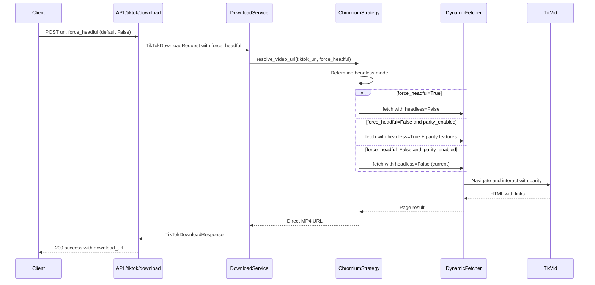

# Sprint 26.2 - TikTok Download force_headful API Flag Implementation

## 1) Title and Summary
- Title: TikTok Download force_headful API Flag and Headless Interaction Parity
- Summary:
  - Implement API flag `force_headful: bool` (default False) in TikTok download endpoint schema
  - Ensure full web interaction parity in headless mode: navigation, search bar interaction, clicking, filling forms, waiting
  - Maintain backwards compatibility while enabling future headless/ headful mode selection
  - Adhere strictly to layered architecture, schema consistency, TDD-first, and Pydantic settings governance

## 2) Background and Current State
- **Previous Implementation**: Sprint 26.1 enforced interim headful mode via Chromium strategy hardcoding `"headless": False` in [ChromiumDownloadStrategy._build_chromium_fetch_kwargs()](app/services/tiktok/download/strategies/chromium.py:234)
- **Schema Status**: `force_headful` field already added to [TikTokDownloadRequest](app/schemas/tiktok/download.py:17-25) with default False
- **Test Coverage**: Comprehensive schema tests exist in [tests/schemas/test_tiktok_download.py](tests/schemas/test_tiktok_download.py:39-81) validating force_headful behavior
- **Current Behavior**: Strategy ignores the flag and enforces headful mode regardless of request parameter
- **Parity Goal**: Enable true headless mode with full web interaction equivalence to headful mode

## 3) Goals and Non-Goals

### Goals
- **API Integration**: Wire `force_headful` flag from request through service to strategy level
- **Headless Parity**: Implement full web interaction parity in headless mode including:
  - Navigation to TikVid resolver pages
  - Search bar interaction and form filling
  - Button clicking and link following
  - Waiting strategies (network idle, selectors, timeouts)
  - MP4 link extraction and resolution
- **Strategy Logic**:
  - When `force_headful=True`: Enforce headful mode (current behavior)
  - When `force_headful=False`: Allow headless mode with parity features
- **Persistent Profiles**: Maintain master/clone Chromium user data management for both modes
- **Backwards Compatibility**: Default behavior unchanged (force_headful=False allows headless when parity achieved)

### Non-Goals
- **No Camoufox Changes**: Do not modify Camoufox strategy behavior
- **No Performance Optimizations**: Focus on functional parity over performance
- **No New Endpoints**: Only modify existing /tiktok/download endpoint behavior
- **No Breaking Changes**: Maintain API compatibility for existing clients

## 4) Detailed Requirements

### API Schema Requirements
- **Existing Schema**: [TikTokDownloadRequest.force_headful](app/schemas/tiktok/download.py:17-25) already implemented
- **Validation**: Field accepts boolean values, defaults to False, included in serialization
- **Documentation**: Field description explains current interim behavior and future parity intent

### Service Layer Requirements
- **Parameter Passing**: [TikTokDownloadService.download_video()](app/services/tiktok/download/service.py:48) must accept and pass through `force_headful` parameter
- **Strategy Interface**: Strategy methods must receive `force_headful` parameter for decision making
- **Error Handling**: Maintain existing error handling and retry logic regardless of headless/headful mode

### Strategy Implementation Requirements
- **Current Hardcoded Behavior**: Replace hardcoded `"headless": False` in [fetch_kwargs](app/services/tiktok/download/strategies/chromium.py:234) with conditional logic
- **Decision Logic**:
  ```python
  headless_mode = not force_headful and headless_parity_enabled
  fetch_kwargs["headless"] = headless_mode
  ```
- **Parity Features**:
  - Enhanced waiting strategies for headless mode
  - Robust element interaction patterns
  - Anti-detection measures effective in both modes
  - Network idle detection and timeout handling

### Headless Interaction Parity Requirements
- **Navigation**: Reliable page navigation and loading detection in headless mode
- **Form Interaction**: Search bar input, text entry, and form submission
- **Click Actions**: Button clicks, link following, and element interaction
- **Waiting Strategies**:
  - Network idle detection for dynamic content
  - Selector-based waiting for specific elements
  - Timeout handling with graceful degradation
- **Content Extraction**: MP4 link parsing and URL resolution consistent across modes

### Persistent User Data Requirements
- **Mode Compatibility**: Master/clone user data management works for both headless and headful
- **Profile Warming**: Cookie persistence and session state maintained across modes
- **Cleanup**: Proper cleanup of user data contexts regardless of browser mode

## 5) Architecture & Changes

### API Layer Changes
- **Endpoint**: [tiktok_download_endpoint()](app/api/tiktok.py:203) extracts `force_headful` from request
- **Service Call**: Pass `force_headful` parameter to download service
- **Response**: No changes to response schema

### Service Layer Changes
- **Method Signature**: Update `download_video()` to accept `force_headful: bool = False`
- **Strategy Passing**: Pass flag to strategy resolution methods
- **Orchestration**: Maintain existing retry and error handling logic

### Strategy Layer Changes
- **Conditional Headless**: Replace hardcoded headless enforcement with conditional logic
- **Parity Implementation**: Add headless-specific enhancements for interaction parity
- **Configuration**: Support future feature flag for enabling headless parity

### Browser Configuration Changes
- **Dynamic Args**: Browser arguments adapted based on headless/headful mode
- **Stealth Features**: Anti-detection measures effective in both modes
- **Resource Management**: Memory and CPU usage considerations for each mode

## 6) TDD Plan (Test-first TODOs)

### API Endpoint Tests
- **File**: [tests/api/test_tiktok_download_endpoint.py](tests/api/test_tiktok_download_endpoint.py)
  - `test_download_endpoint_with_force_headful_true`: Verify flag passed to service
  - `test_download_endpoint_with_force_headful_false`: Verify default behavior
  - `test_download_endpoint_force_headful_parameter_passing`: Mock service to verify parameter

### Service Layer Tests
- **File**: `tests/services/tiktok/download/test_service.py`
  - `test_download_video_passes_force_headful_to_strategy`: Verify parameter propagation
  - `test_download_video_force_headful_default_behavior`: Test default False handling
  - `test_download_video_handles_both_modes`: Test both True/False scenarios

### Strategy Unit Tests
- **File**: [tests/services/tiktok/download/test_download_strategies.py](tests/services/tiktok/download/test_download_strategies.py)
  - `test_chromium_strategy_headless_when_force_headful_false`: Assert headless mode when flag False
  - `test_chromium_strategy_headful_when_force_headful_true`: Assert headful mode when flag True
  - `test_chromium_strategy_parity_features_in_headless`: Verify parity enhancements
  - `test_chromium_strategy_user_data_in_both_modes`: Test persistent profiles

### Headless Parity Tests
- **File**: `tests/services/tiktok/download/test_headless_parity.py`
  - `test_navigation_parity_headless_vs_headful`: Compare navigation behavior
  - `test_form_interaction_parity`: Test search bar and form interactions
  - `test_click_interaction_parity`: Test button and link clicking
  - `test_waiting_strategy_parity`: Test network idle and selector waiting
  - `test_content_extraction_parity`: Test MP4 link extraction consistency

### Integration Tests
- **File**: [tests/integration/tiktok/test_download_chromium_strategy.py](tests/integration/tiktok/test_download_chromium_strategy.py)
  - `test_real_download_force_headful_true`: End-to-end headful download
  - `test_real_download_force_headful_false`: End-to-end headless download with parity
  - `test_download_parity_comparison`: Compare results between modes
  - `test_persistent_user_data_both_modes`: Test user data in both modes

## 7) Acceptance Criteria

### Functional Criteria
- **API Integration**: `force_headful` flag correctly propagated from request to strategy
- **Mode Selection**: Strategy correctly chooses headless/headful based on flag and parity state
- **Parity Achievement**: Headless mode provides equivalent functionality to headful mode
- **Success Rate**: Both modes achieve >90% success rate for known test URLs
- **Response Consistency**: Identical response structure and data quality across modes

### Performance Criteria
- **Headless Efficiency**: Headless mode shows resource usage improvement over headful
- **Parity Overhead**: Headless parity features do not significantly impact performance
- **Timeout Handling**: Both modes handle network conditions and timeouts gracefully

### Quality Criteria
- **Test Coverage**: All new features covered by unit and integration tests
- **Code Quality**: Passes flake8 linting and maintains architectural patterns
- **Documentation**: Updated API docs and code comments for new functionality

### Compatibility Criteria
- **Backwards Compatibility**: Existing clients continue to work without changes
- **Default Behavior**: Default force_headful=False provides expected behavior
- **Schema Consistency**: Request/response schemas maintain version compatibility

## 8) Risks, Mitigations, and Rollback

### Risks
- **Parity Gaps**: Headless mode may have interaction differences compared to headful
- **Detection Differences**: Anti-detection effectiveness may vary between modes
- **Resource Variability**: Headless mode resource usage patterns may differ
- **Test Flakiness**: Integration tests may show different stability characteristics

### Mitigations
- **Comprehensive Testing**: Extensive parity testing across interaction types
- **Gradual Rollout**: Feature flag approach for enabling headless parity
- **Monitoring**: Enhanced logging and metrics for both modes
- **Fallback Strategy**: Ability to fallback to headful mode if parity issues detected

### Rollback Plan
- **Strategy Reversion**: Restore hardcoded headful enforcement if parity inadequate
- **Feature Flag**: Disable headless parity via configuration if needed
- **API Compatibility**: Maintain force_headful flag but ignore until parity stable

## 9) Validation & Benchmarks

### Validation Commands
```bash
# Unit tests
python -m pytest tests/schemas/test_tiktok_download.py -v
python -m pytest tests/api/test_tiktok_download_endpoint.py -v
python -m pytest tests/services/tiktok/download/test_download_strategies.py -v

# Integration tests
python -m pytest tests/integration/tiktok/test_download_chromium_strategy.py -v

# Parity-specific tests
python -m pytest tests/services/tiktok/download/test_headless_parity.py -v

# Full test suite
python -m pytest
```

### Benchmark Criteria
- **Success Rate**: >90% for both modes across 20 consecutive runs
- **Latency**: Headless mode within 20% of headful mode performance
- **Resource Usage**: Headless mode shows 30-50% memory reduction
- **Parity Score**: >95% functional parity across interaction types

### Quality Gates
- **Code Coverage**: >90% coverage for new functionality
- **Linting**: Zero flake8 violations in app/ and tests/
- **Integration Tests**: All integration tests pass consistently
- **Documentation**: Updated API docs reflect new functionality

## 10) Deliverables and Timeline

### Deliverables
- **Service Layer Updates**: Modified download service with force_headful parameter
- **Strategy Implementation**: Updated Chromium strategy with conditional headless logic
- **Parity Features**: Headless interaction parity enhancements
- **Test Suite**: Comprehensive unit and integration test coverage
- **Documentation**: Updated API documentation and implementation notes

### Timeline
- **Day 1**: Service layer changes and parameter propagation
- **Day 2**: Strategy conditional logic and basic headless parity
- **Day 3**: Advanced parity features and comprehensive testing
- **Day 4**: Integration testing, benchmarking, and documentation

## 11) Appendix: Implementation Details

### Key File Modifications
- **Service**: [app/services/tiktok/download/service.py](app/services/tiktok/download/service.py:48)
- **Strategy**: [app/services/tiktok/download/strategies/chromium.py](app/services/tiktok/download/strategies/chromium.py:234)
- **Endpoint**: [app/api/tiktok.py](app/api/tiktok.py:203)
- **Tests**: Multiple test files for comprehensive coverage

### Configuration Considerations
- **Feature Flag**: Optional setting for enabling headless parity independently
- **Default Behavior**: Maintains current headful enforcement until parity verified
- **Environment Support**: Different behaviors for development vs production

### Mermaid: Enhanced Flow with force_headful Logic


### Governance Alignment
- **Layered Architecture**: Clean separation maintained across API/Service/Strategy layers
- **Pydantic Settings**: Configuration-based feature flags and behavior controls
- **TDD-First**: Comprehensive test coverage before implementation
- **Schema Consistency**: Backwards-compatible API design following existing patterns
- **Security**: Anti-detection measures maintained across both browser modes